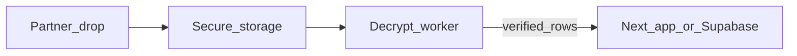

# Partner data via PGP (OpenPGP) — standard operating procedure

This document supports the **recommended** flow: the partner encrypts files to **your public key**; you decrypt **on a trusted machine** and import through existing admin or Supabase workflows. The production web app does **not** store your private key.

## Roles

| Party | Responsibility |
|--------|----------------|
| You (Republic / ops) | Create key pair; share **public** key only; decrypt; validate; import |
| Partner | Encrypt payload to your public key; deliver ciphertext over the agreed channel |

---

## 1. One-time: install GnuPG (Windows)

If `gpg` is not on your PATH yet:

```powershell
winget install --id GnuPG.GnuPG --accept-package-agreements --accept-source-agreements
```

After install, you may need a **new terminal** (or sign out/in) for `gpg` to appear on PATH. Helper scripts in `scripts/` also probe common install paths.

---

## 2. One-time: create or approve a key pair

**Preferred:** use an **organizational** key or subkey if IT/security already provisions OpenPGP for partner feeds.

**Otherwise:** create a dedicated key for this feed (strong passphrase, stored in your password manager):

```text
gpg --full-gen-key
```

Typical choices: RSA 4096 or modern default; identity string should identify this use (e.g. real name + role + work email). **Expiry** (e.g. 2 years) is recommended so rotation is routine.

**Backup:** export a **secret key backup** to encrypted offline storage per your security policy — not email, not Slack. Only people authorized to decrypt partner files should hold the passphrase and backup.

```text
gpg --armor --export-secret-keys KEY_ID_OR_EMAIL > BACKUP-DO-NOT-COMMIT.asc
```

(Keep that file offline; never commit it to git.)

Confirm the key exists:

```text
gpg --list-secret-keys --keyid-format LONG
```

---

## 3. Publish your **public** key to the partner

Export **ASCII-armored** public key only (safe to distribute):

From repo root, using the helper script (writes under `partner-pgp-local/` by default — that folder is git-ignored except its `README.md`; see [`.gitignore`](../.gitignore)):

```powershell
powershell -File scripts/export-partner-public-key.ps1 -KeyIdentifier "your.work.email@company.com"
```

Or manually:

```text
gpg --armor --export your.work.email@company.com > republic-new-hires-partner-public.asc
```

**Send** `*.asc` to the partner via your agreed secure channel (SFTP onboarding, ticketing system with attachments, validated vendor portal — follow org policy).

**Never send:** private keys, passphrases, or decrypted payloads through informal channels.

---

## 4. Agree with the partner: channel and file format

Copy or adapt this checklist into email or a short data agreement:

### Data specification (example)

| Topic | Decision |
|--------|-----------|
| **Payload** | e.g. `.csv`, `.xlsx` — spell out UTF-8 for CSV |
| **Columns** | For code assignments: **`email`**, **`code`**, optional **`name`** (matches `/admin` import for `ra_new_hire_code_assignments`) |
| **Filename pattern** | e.g. `ra-new-hires-assignments-YYYYMMDD.xlsx.asc` |
| **Frequency** | e.g. weekly / on hire batch |
| **Delivery** | SFTP path, secured share URL, etc. |
| **Encryption** | OpenPGP; encrypt **to our public key** in `republic-new-hires-partner-public.asc` |
| **Optional: signing** | Partner signs with **their** key; we verify with `gpg --verify` (separate trust step) |

### Operational contacts

Record **technical contact + escalation path** on both sides for failed decrypts or bad file shape.

HTTPS API keys used elsewhere in this repo (for example fulfillment pull auth) address **transport authorization** to your app — they **do not** replace OpenPGP for **file encryption** unless you deliberately choose a purely API-based design.

---

## 5. Each delivery: decrypt (local)

Save the ciphertext (`.gpg`, `.pgp`, `.asc`, etc.) to a sensible place (example: `partner-pgp-local/inbox/`).

Decrypt with the helper:

```powershell
powershell -File scripts/decrypt-partner-file.ps1 -CipherFile ".\partner-pgp-local\inbox\partner-batch.gpg" -PlainOutPath ".\partner-pgp-local\decrypted\assignments.xlsx"
```

Or manually:

```text
gpg --output decrypted.xlsx --decrypt partner-batch.gpg
```

You will be prompted for the key **passphrase** (or use gpg-agent after first unlock).

---

## 6. Validate and import

1. **Inspect** decrypted file size and open in Excel (or CSV viewer) — confirm rows look reasonable and columns match what you documented with the partner.
2. **PII hygiene:** decrypted files belong in `partner-pgp-local/decrypted/` (git-ignored); delete when retention policy allows.
3. **Import:**
   - **Admin UI:** sign in with the admin flow, open **assignment upload**, use the spreadsheet import for `email` / `code` / `name` per existing behavior on `/admin`.
   - **Alternatively:** bulk insert via Supabase SQL/dashboard if approved by your DBA playbook.

---

## 7. Key rotation

1. Generate a new key (or rotate subkey) before the old **expiry**.
2. Export and send **new public** `.asc` to the partner.
3. Retain ability to decrypt **old** ciphertext until retention allows — keep old backup only as long as policy requires.

---

## 8. Phase 2 (optional automation) — design only

Use this section only when **local decrypt becomes too heavy**. It increases operational and security complexity.

**Goal:** automate decrypt + ingestion without putting long-lived plaintext in logs.

### Constraints

- **Vercel serverless** lacks a dependable bundled `gpg` binary — prefer **pure JS** decrypt with [OpenPGP.js](https://openpgpjs.org/) **or** a **worker/VM/container** where `gpg` is installed.
- The **private key** and passphrase must live in **KMS/secrets manager** (e.g. split: key armored blob in vault, passphrase injected at runtime).
- Trusted party only: route through **authenticated admin**, **VPC-only job**, or **scheduled worker** reading from SFTP drop.

### Outline



1. Partner uploads ciphertext to agreed storage (S3/SFTP).
2. Worker loads ciphertext, loads **private** key material from KMS, decrypts in memory.
3. Validate schema; write to `ra_new_hire_code_assignments` (or staging table) via service role.
4. Never log file contents; redact errors; enforce idempotency (batch id / hash).

Security review (IT/InfoSec) should precede implementation.

---

## Related repository files

| File | Purpose |
|------|---------|
| [`scripts/gpg-common.ps1`](../scripts/gpg-common.ps1) | Resolves `gpg.exe` on Windows |
| [`scripts/export-partner-public-key.ps1`](../scripts/export-partner-public-key.ps1) | Export public `.asc` for the partner |
| [`scripts/decrypt-partner-file.ps1`](../scripts/decrypt-partner-file.ps1) | Local decrypt helper |
| [`partner-pgp-local/README.md`](../partner-pgp-local/README.md) | Local folder convention (git-ignored artifacts) |
